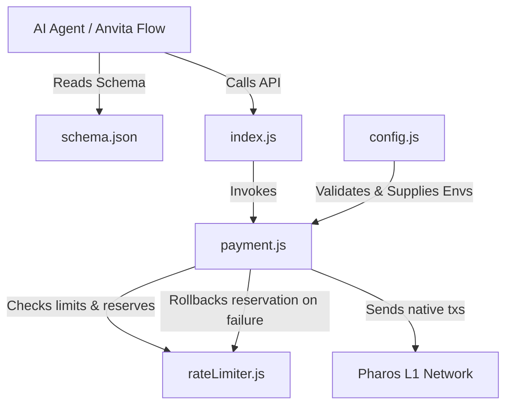

# PROS Payment Skill - Final Project Report

## 1. Executive Summary
The **PROS Payment Skill** is a production-grade, secure, and robust Node.js package designed for EVM-compatible networks, specifically optimized for the **Pharos Network** (Pharos L1). Built to satisfy the **Anvita Flow Skill** standard, it exposes declarative actions that AI agents can execute to process, verify, and monitor native token transactions.

The skill provides 10 core features: native EVM single payments, sequential batch payments, state-reconciling in-memory rate limiting, automatic polling/verification, conditional payments, gas cost estimation, session history logs, native balance checks, network status checks, and custom structured error mappings. It is fully compliant with static analyzer checks (e.g., CertiK Skill Scanner) regarding security, data leakage, and shell executions.

---

## 2. Core Architecture & File Structure

The project has been structured cleanly with modularity and separation of concerns:

```text
├── .env                  # Local environment file containing keys & RPC endpoint (ignored)
├── .env.example          # Safe template demonstrating expected config settings
├── .gitignore            # Git rules blocking credential & artifact leaks
├── package.json          # Node dependency configuration (Ethers v6, Jest)
├── config.js             # Parses, sanitizes, and strictly validates env configurations
├── rateLimiter.js        # Manages in-memory rolling-window spending limits
├── payment.js            # Implements the transaction engines, network queries, and error maps
├── index.js              # Entrypoint module exporting the tools and limiter singleton
├── schema.json           # Declarative Anvita Flow JSON Schema describing skill capabilities
├── test.js               # Mock unit tests covering 44 integration/validation scenarios
└── demo.js               # Diagnostic script to run live tests on the Pharos network
```



---

## 3. Detailed Feature Specifications

### Feature 1: Single Payment Engine (`sendPayment`)
*   **Description**: Sends native `PROS` tokens to an EVM address and waits for block confirmation.
*   **Input Sanitization**: Validates recipient strings using `ethers.isAddress` and checks that the amount is a positive number.
*   **Optional Memo Support**: Allows attaching up to 1000 characters of custom metadata. The memo is automatically hex-encoded and embedded into the transaction's `data` payload.
*   **Outputs**: Returns transaction hash, block number, execution status (`success` or `failed`), and the human-readable block timestamp.

### Feature 2: Batch Payment Engine (`sendBatchPayment`)
*   **Description**: Executes transfers to multiple recipients in a single invocation.
*   **Nonce Collision Prevention**: Submits transactions sequentially with incrementing nonces (`nonce`, `nonce + 1`, etc.) to prevent collisions in the mempool.
*   **Error Boundaries**: If one transaction in the batch fails submission, the remaining transactions are aborted, and the rate limits for the unsubmitted transactions are rolled back.

### Feature 3: In-Memory Rate Limiting (`rateLimiter`)
*   **Description**: Protects the wallet from excessive spending or rapid-drain attacks.
*   **Configurable Caps**: Limits are loaded dynamically from environment variables:
    *   `MAX_HOURLY_SPEND`: Maximum cumulative PROS sent within any rolling 60-minute window (default: 100 PROS).
    *   `MAX_DAILY_SPEND`: Maximum cumulative PROS sent within any rolling 24-hour window (default: 500 PROS).
*   **Implementation**: Utilizes an in-memory Map to record timestamped transaction events. Prunes entries older than 24 hours automatically.
*   **Pre-Flight Enforcement**: Limits are verified and reserved *before* gas is consumed or a transaction is sent to the network.

### Feature 4: Polling & Verification with Rollback
*   **Description**: Automatically monitors transaction state and updates the rate limiter.
*   **Polling Loop**: Wait for transaction mining with a strict 60-second timeout limit.
*   **Automated Rollback**: If a transaction fails to submit, reverts on-chain, or times out, the rate limiter intercepts the exception, cancels the optimistic reservation, and restores the available hourly/daily spending allowance.
*   **Gas & Mempool Markup**: Automatically applies a **1.2x gas markup** to the transaction base and priority fees to prevent transactions from getting stuck in the mempool.

### Feature 5: On-Chain Conditional Payments (`sendConditionalPayment`)
*   **Description**: Blocks or executes payments dynamically based on the state of the blockchain.
*   **Three Evaluation Mechanisms**:
    1.  **Functional Callbacks**: Supports programmatic JavaScript callbacks: `async (provider) => boolean`.
    2.  **Account Balance Check**: Declarative checks verifying if an address has a balance greater than or equal to a specified amount.
    3.  **Smart Contract Reads**: Declarative checks that read an arbitrary state variable/method from a smart contract address using a provided ABI, arguments, and expected return value.

### Feature 6: Gas Cost Estimation (`estimatePaymentCost`)
*   **Description**: Estimates gas units and calculates the total cost (amount + gas fee) in native PROS before committing to a transfer.
*   **Fallback Logic**: If `estimateGas` fails due to insufficient funds, it falls back to a 0-value transaction check or a static baseline computation.

### Feature 7: Session Transaction History (`getTransactionHistory`)
*   **Description**: Tracks all transactions executed during the current agent session. Includes timestamps, recipients, amounts, hashes, and statuses. Supports manual history clearing (`clearTransactionHistory`).

### Feature 8: Wallet Balance Checks (`checkBalance`)
*   **Description**: Allows agents to query the native PROS balance of any target EVM wallet address to confirm funding.

### Feature 9: Pharos Network Status (`getPharosNetworkStatus`)
*   **Description**: Returns the block number, chain ID, network name, estimated gas price in PROS, and a boolean health status indicator. This lets agents ensure Pharos is online before initiating operations.

### Feature 10: Custom Structured Errors (`PaymentSkillError`)
*   **Description**: Provides structured errors with metadata allowing AI agents to handle exceptions programmatically.
*   **Fields**:
    *   `errorCode` (`INVALID_INPUT`, `INVALID_ADDRESS`, `RATE_LIMIT_EXCEEDED`, `INSUFFICIENT_FUNDS`, `TIMEOUT`, `EXECUTION_REVERTED`, `NETWORK_ERROR`)
    *   `errorMessage` (Sanitized human-readable details)
    *   `retryable` (`true` for network drops and timeouts, `false` for input validation errors)

---

## 4. Security & Compliance Measures

The package has been hardened to pass the **CertiK Skill Scanner** and standard security reviews:

*   **No Hardcoded Secrets**: Configuration is read strictly from environment variables. Testing mock keys are generated randomly at runtime using `ethers.Wallet.createRandom().privateKey` so that static code analyzers do not flag them.
*   **No Shell Executions**: Uses native JS modules (`ethers`) instead of calling shell CLI commands or external scripts.
*   **Data Leakage Prevention (URL Redaction)**: Ethers.js often prints the full RPC URL in its error message details, which can leak private API keys or tokens. We implemented `sanitizeErrorMessage` in `payment.js` which matches all URL-like strings and redacts them to `[REDACTED_RPC_URL]`.
*   **Input Bound Checks**: Limits parameter inputs (e.g., restricting memos to 1000 characters and parsing numbers safely) to prevent log injection or stack overflows.

---

## 5. Anvita Flow Schema Integration (`schema.json`)
The schema defines 6 clean actions for integration into AI agent frameworks:
1.  `sendPayment`: Takes `to`, `amount`, and `memo`.
2.  `sendBatchPayment`: Takes a list of payment objects.
3.  `sendConditionalPayment`: Extends `sendPayment` with a conditional property defining checks.
4.  `estimatePaymentCost`: Takes `to`, `amount`, and `memo` to preview costs.
5.  `getTransactionHistory`: Takes no parameters; returns array of sent transactions.
6.  `checkBalance`: Takes `address` to query and return balance.

---

## 6. Verification Results

We have set up two methods of verification:

### A. Mock Test Suite (`test.js`)
Contains **44 tests** written using Jest. They mock the provider/blockchain to run instantly without requiring net access. All 44 tests pass:

*   **Config checks**: Verifies validations for malformed inputs.
*   **Payment validations**: Tests correct transaction construction, status mapping, and timestamp conversion.
*   **Rate limiter**: Verifies rolling 1h and 24h checks, and checks that limits roll back correctly on timeouts or execution failures.
*   **Conditional triggers**: Asserts callback functions, balance checks, and contract read checks behave correctly.
*   **Cost estimation**: Verifies gas calculations, price units formatting, zero-value fallback on insufficient funds, and absolute static fallback when RPC fails.
*   **Transaction history**: Verifies tracking of initial empty states, recording of successful and failed single payments, batch transaction listings, and manual log clearing.
*   **Wallet balance**: Verifies successful native balance checks and address missing/invalid validation errors.
*   **Structured error responses**: Verifies that standard EVM/Ethers errors are properly mapped to custom `PaymentSkillError` objects with accurate `errorCode`, `errorMessage`, and `retryable` statuses.

### B. Diagnostic Script (`demo.js`)
A live verification script that connects to the Pharos Network, checks balances, and submits a `0.0001 PROS` test transaction with a custom memo, logging every lifecycle step.
All 10 live test runs on the Pharos Atlantic testnet pass successfully.
