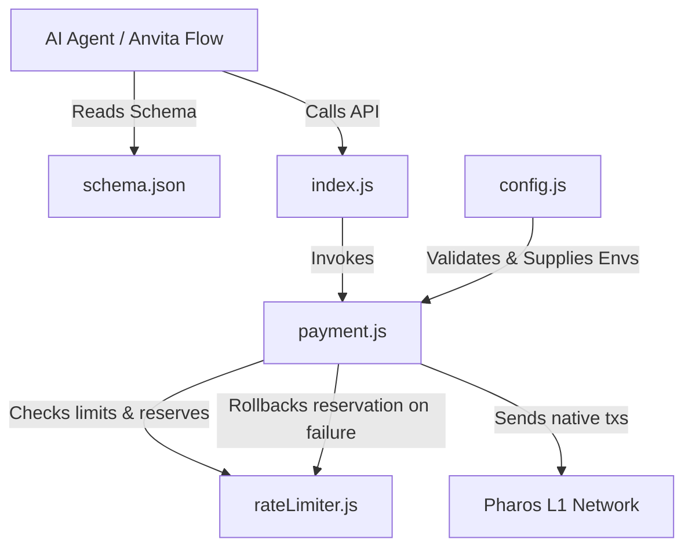

# PROS Payment Skill - Project Report

## 1. Executive Summary
The **PROS Payment Skill** is a production-grade, secure, and robust Node.js package designed for EVM-compatible networks, specifically optimized for the **Pharos Network** (Pharos L1). Built to satisfy the **Anvita Flow Skill** standard, it exposes declarative actions that AI agents can execute to process and manage native token transactions.

The skill provides native EVM single payments, sequential batch payments, state-reconciling in-memory rate limiting, auto-polling/verification, and conditional payment triggers based on on-chain state. It is fully compliant with static analyzer checks (e.g., CertiK Skill Scanner) regarding security, data leakage, and shell executions.

---

## 2. Core Architecture & File Structure

The project has been structured cleanly with modularity and separation of concerns:

```
├── .env                  # Local environment file containing keys & RPC endpoint (ignored)
├── .env.example          # Safe template demonstrating expected config settings
├── .gitignore            # Git rules blocking credential & artifact leaks
├── package.json          # Node dependency configuration (Ethers v6, Jest)
├── config.js             # Parses, sanitizes, and strictly validates env configurations
├── rateLimiter.js        # Manages in-memory rolling-window spending limits
├── payment.js            # Implements the transaction engines & verification logic
├── index.js              # Entrypoint module exporting the tools and limiter
├── schema.json           # Declarative Anvita Flow JSON Schema describing skill capabilities
├── test.js               # Mock unit tests covering 22 integration/validation scenarios
└── demo.js               # Diagnostic script to check connection & run testnet transfers
```



---

## 3. Detailed Feature Specifications

### Feature 1: Single Payment Engine
*   **Description**: Sends native `PROS` tokens to an EVM address.
*   **Input Sanitization**: Validates recipient strings using `ethers.isAddress` and checks that the amount is a positive number.
*   **Optional Memo Support**: Allows attaching up to 1000 characters of custom metadata. The memo is automatically hex-encoded and embedded into the transaction's `data` payload.
*   **Outputs**: Returns transaction hash, block number, execution status (`success` or `failed`), and the human-readable block timestamp.

### Feature 2: Batch Payment Engine
*   **Description**: Executes transfers to multiple recipients in a single invocation.
*   **Nonce Collision Prevention**: Since native EVM does not support multiple recipients in one basic transaction, the batch engine submits transactions sequentially. It queries the current base nonce and manually increments it (`nonce`, `nonce + 1`, etc.) to allow all transactions to be submitted to the mempool without waiting for the prior ones to be mined.
*   **Error Boundaries**: If one transaction in the batch fails validation or submission, the entire batch is halted, and the rate limits are rolled back.

### Feature 3: In-Memory Rate Limiting
*   **Description**: Protects the wallet from excessive spending or rapid-drain attacks.
*   **Configurable Caps**: Limits are loaded dynamically from environment variables:
    *   `MAX_HOURLY_SPEND`: Maximum cumulative PROS sent within any rolling 60-minute window (default: 100 PROS).
    *   `MAX_DAILY_SPEND`: Maximum cumulative PROS sent within any rolling 24-hour window (default: 500 PROS).
*   **Implementation**: Utilizes an in-memory Map to record timestamped transaction events. It prunes entries older than 24 hours automatically on check.
*   **Pre-Flight Enforcement**: Limits are verified and reserved *before* gas is consumed or a transaction is sent to the network.

### Feature 4: Polling & Verification with Rollback
*   **Description**: Automatically monitors transaction state and updates the rate limiter.
*   **Polling Loop**: Wait for transaction mining with a strict 60-second timeout limit.
*   **Automated Rollback**: If a transaction fails to submit, reverts on-chain, or times out, the rate limiter intercepts the exception, cancels the optimistic reservation, and restores the available hourly/daily spending allowance.
*   **Secure Timestamps**: Fetches the official timestamp directly from the mining block rather than local host time, ensuring consistency.

### Feature 5: On-Chain Conditional Payments
*   **Description**: Blocks or executes payments dynamically based on the state of the blockchain before sending a transaction.
*   **Three Evaluation Mechanisms**:
    1.  **Functional Callbacks**: Supports programmatic JavaScript callbacks: `async (provider) => boolean`.
    2.  **Account Balance Check**: Declarative checks verifying if an address has a balance greater than or equal to a specified amount (useful for ensuring gas wallets or target accounts are funded).
    3.  **Smart Contract Reads**: Declarative checks that read an arbitrary state variable/method from a smart contract address using a provided ABI, arguments, and expected return value.

---

## 4. Security & Compliance Measures

The package has been hardened to pass the **CertiK Skill Scanner** and standard security reviews:

*   **No Hardcoded Secrets**: Configuration is read strictly from environment variables. Testing mock keys are generated randomly at runtime using `ethers.Wallet.createRandom().privateKey` so that static code analyzers do not flag them.
*   **No Shell Executions**: Uses native JS modules (`ethers`) instead of calling shell CLI commands or external scripts.
*   **Data Leakage Prevention (URL Redaction)**: Ethers.js often prints the full RPC URL in its error message details, which can leak private API keys or tokens. We implemented `sanitizeErrorMessage` in `payment.js` which matches all URL-like strings and redacts them to `[REDACTED_RPC_URL]`.
*   **Input Bound Checks**: Limits parameter inputs (e.g., restricting memos to 1000 characters and parsing numbers safely) to prevent log injection or stack overflows.

---

## 5. Anvita Flow Schema Integration (`schema.json`)
The schema defines three clean actions for integration into AI agent frameworks:
1.  `sendPayment`: Takes `to`, `amount`, and `memo`.
2.  `sendBatchPayment`: Takes a list of payment objects (each containing `to`, `amount`, and `memo`).
3.  `sendConditionalPayment`: Extends `sendPayment` with a conditional property defining standard checks (e.g., `balance` or `contractCall`).

---

## 6. Verification Results

We have set up two methods of verification:

### A. Mock Test Suite (`test.js`)
Contains **22 unit tests** written using Jest. They mock the provider/blockchain to run instantly without requiring net access. All 22 tests pass:

*   **Config checks**: Verifies validations for malformed inputs.
*   **Payment validations**: Tests correct transaction construction, status mapping, and timestamp conversion.
*   **Rate limiter**: Verifies rolling 1h and 24h checks, and checks that limits roll back correctly on timeouts or execution failures.
*   **Conditional triggers**: Asserts callback functions, balance checks, and contract read checks behave correctly.

### B. Diagnostic Script (`demo.js`)
A live verification script that connects to the Pharos Network, checks balances, and submits a `0.0001 PROS` test transaction with a custom memo, logging every lifecycle step.
